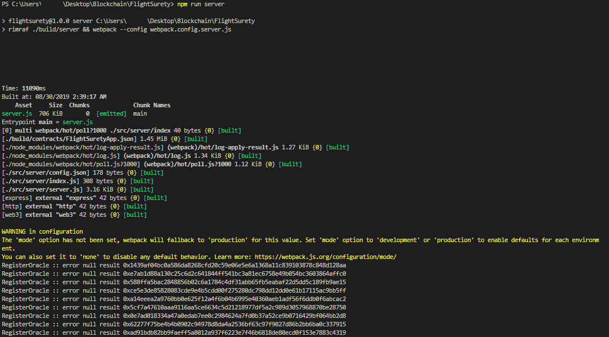
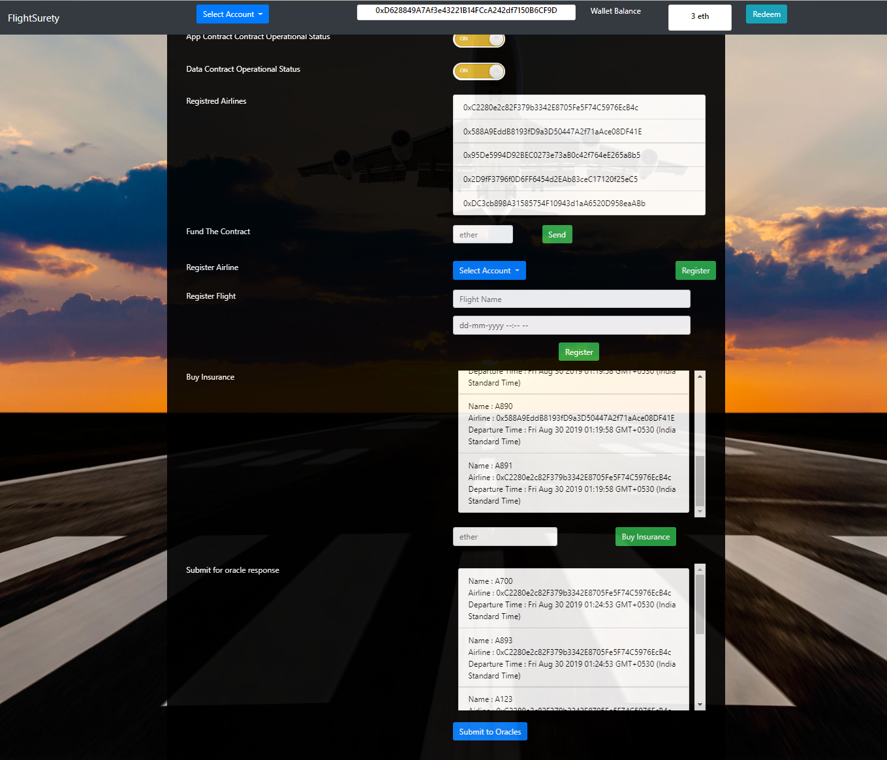
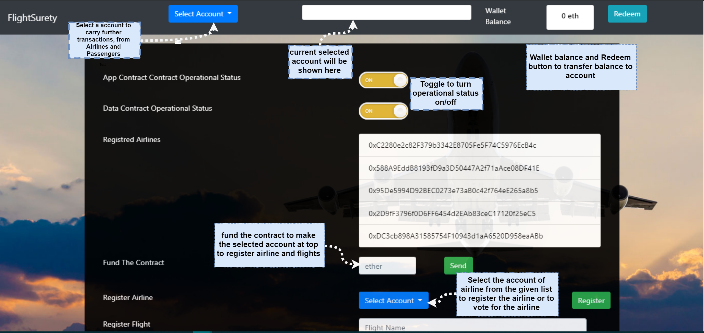
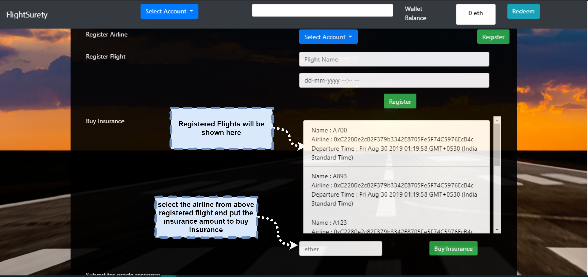
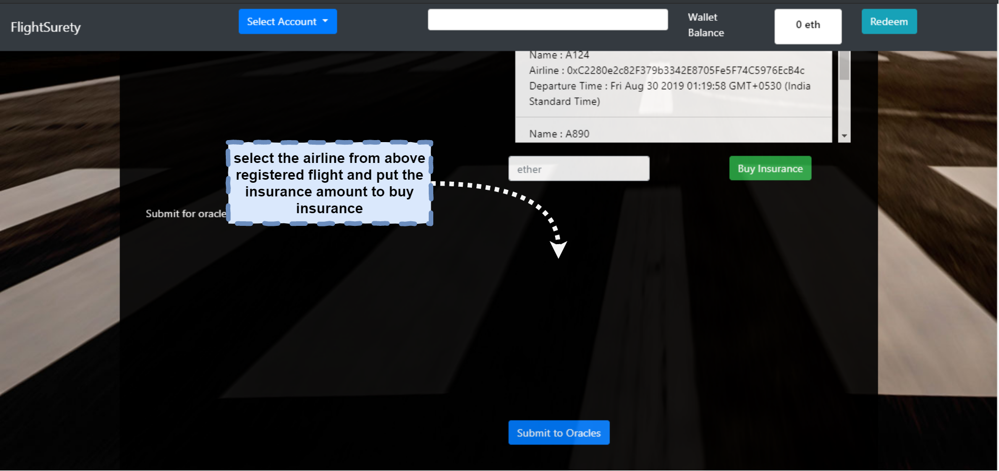

# FlightSurety

FlightSurety is a blockchain application to buy insurance for flights. This application uses two contracts, Data contract and App contract.
Frontend uses web3 to interact with those contracts. The usecase for this application is that a per registred airline can register another airline, if the number of airline registred are 4 then 5th airline has to get consious of other 50% registred airline to get register. Airlines has to fund the contract with 10 ether to perform operation on registration of flights and ailines. Airlines can register a flight. The registred flight can be used to buy insurance of 1 ether maxmimum by the passengres. Passengres can request for flight status from oracle. If the requested status of flight is delayed due to airline then the passengres who bought this insurance will get the 1.5 times the amount of bought insurance. Passengers can redeem that amount from the wallet.

## Install

This repository contains Smart Contract code in Solidity (using Truffle), tests (also using Truffle), dApp scaffolding (using HTML, CSS and JS) and server app scaffolding.

To install, download or clone the repo, then:

`npm install`
`truffle compile`

## Develop Client

To run truffle tests:

`truffle test ./test/flightSurety.js`
`truffle test ./test/oracles.js`

To use the dapp:

`truffle migrate`
`npm run dapp`

To view dapp:

`http://localhost:8000`

## Develop Server

`npm run server`

`truffle test ./test/oracles.js`

## Deploy

To build dapp for prod:
`npm run dapp:prod`

Deploy the contents of the ./dapp folder

## Testing with truffle
To deploy the contracts
`truffle develop`
`migrate --reset`

To execute the test cases
`test`

## Testing UI 

1. Overview FlightSurety

2. Part 1

3. Part 2

4. Part 3

## Resources

* [How does Ethereum work anyway?](https://medium.com/@preethikasireddy/how-does-ethereum-work-anyway-22d1df506369)
* [BIP39 Mnemonic Generator](https://iancoleman.io/bip39/)
* [Truffle Framework](http://truffleframework.com/)
* [Ganache Local Blockchain](http://truffleframework.com/ganache/)
* [Remix Solidity IDE](https://remix.ethereum.org/)
* [Solidity Language Reference](http://solidity.readthedocs.io/en/v0.4.24/)
* [Ethereum Blockchain Explorer](https://etherscan.io/)
* [Web3Js Reference](https://github.com/ethereum/wiki/wiki/JavaScript-API)